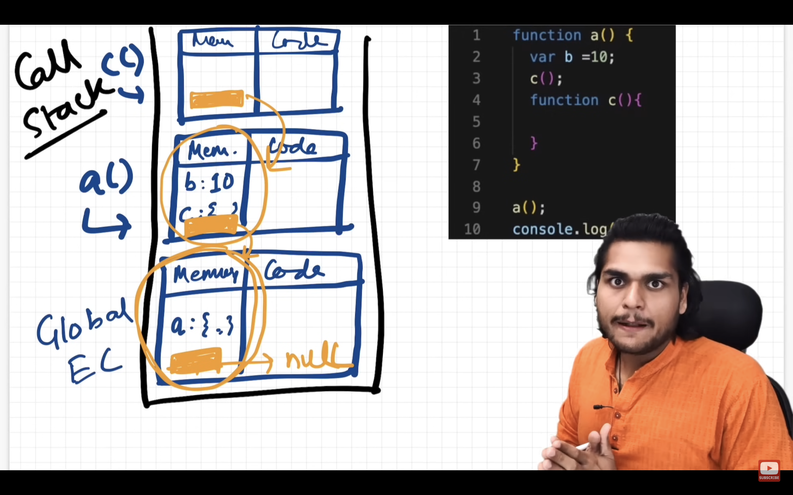

#### # Scope chain,scope and lexical envoirnment

---

##### # scope and lexical envoirnment

whenever execution context is created a Lexical envoirnment is also created it is a local memory along with lexical envoirnment of it's parent.

lexical envoirnment is the local memory along with it's lexical envoirnment of it's parent (lexical means hierarchy) or it's also called refrence of parent lexical scope.

<pre style="background-color:#D9D9D9;border-radius:8px;"><b>
function a() {
    var b = 10; 
      function c() { 
        console.log(b);
         }
      }
        a();
         console.log(b);
      </b></pre>

when execution context is created a refrence to lexical scope of it's parent for e.g -> in above code <b>c</b> has access to lexical envoirnment of <b>a</b> and <b>a</b> has lexical access of global context in whichc lexical parent will be null because it has no parent

<figure>

<figcaption style="font-weight:700;">*lexical scope envoirnment</figcaption>
</figure>

##### # scope chain

way of finding is known as scope chain it's chain of all these lexical envoirnment and parent refrences

if some value is not present in parent lexical scope then it will find it outside it's parent lexical scope finding of this variable is known as <b>scope chain</b>.
